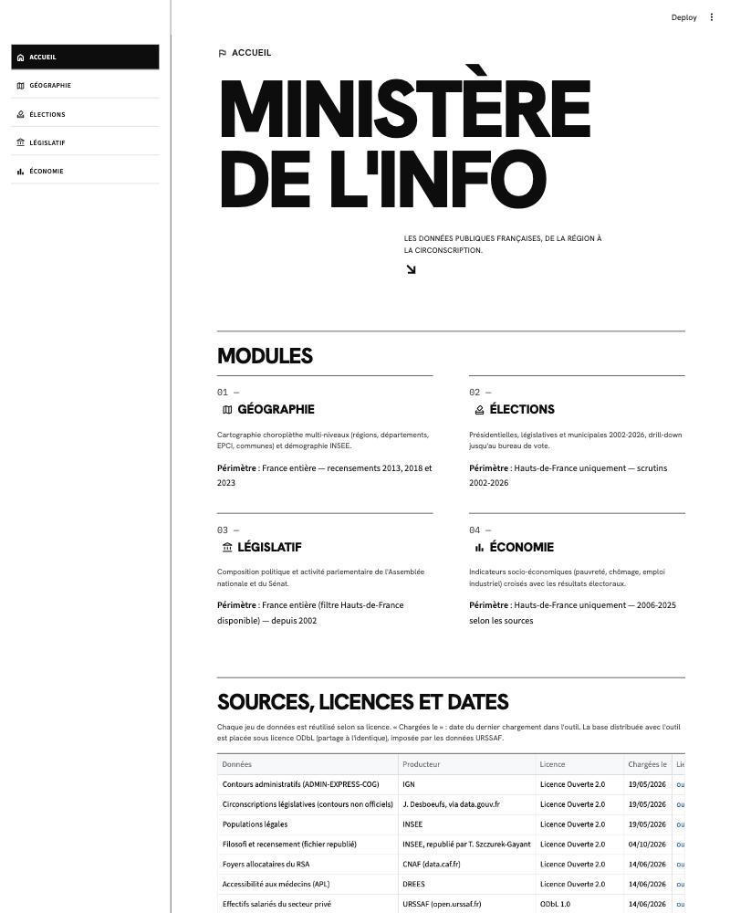
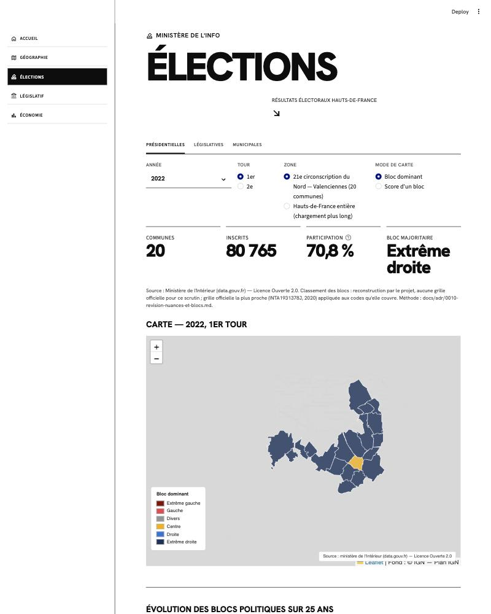
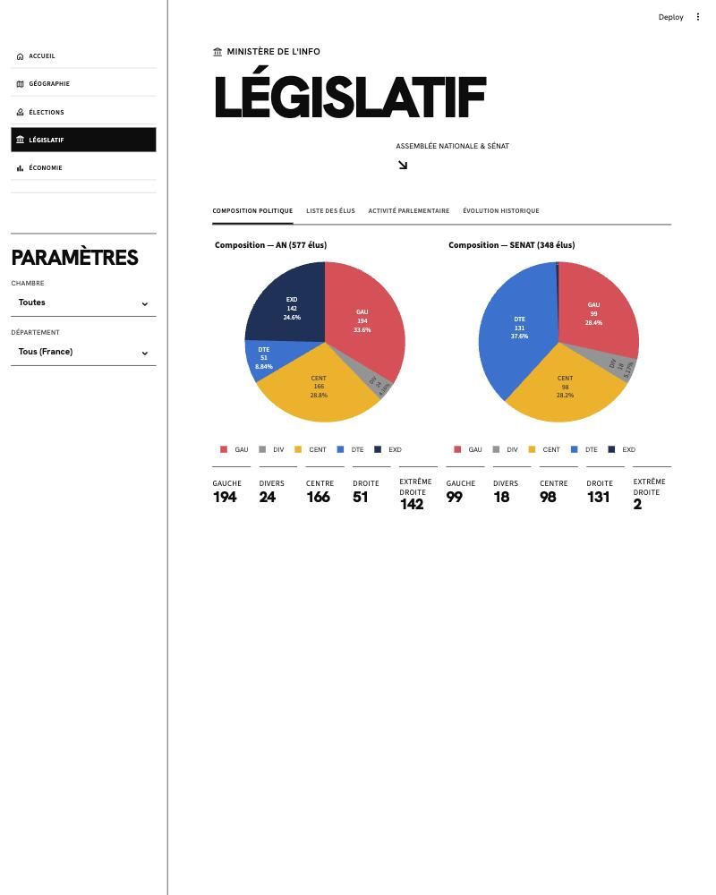

# Ministère de l'Info

[](https://github.com/crocdeine/ministere-de-l-info/actions/workflows/ci.yml)

Un outil de cartes et de graphiques pour comprendre les territoires, les élections et le Parlement en France, à partir des seules données publiques officielles.

Il sert à l'analyse politique et territoriale : lire des résultats électoraux ou des indicateurs locaux sans manipuler de fichiers bruts. Projet personnel, diffusé à un cercle restreint de lecteurs. L'application tourne sur l'ordinateur de l'utilisateur, sans compte ni service en ligne.

## Ce que l'outil permet de faire

| Module | Contenu | Périmètre |
|---|---|---|
| Géographie | Régions, départements, intercommunalités, communes, arrondissements, circonscriptions ; populations 2013, 2018 et 2023 | France |
| Élections | Présidentielles 2002-2022, législatives 2002-2024, municipales 2008-2026 ; cartes par bloc politique, évolution dans le temps, détail jusqu'au bureau de vote | Hauts-de-France |
| Législatif | Députés (législatures 12 à 17) et sénateurs : composition politique, liste des élus, activité des députés, évolution par législature | France, filtre par département |
| Économie | Revenus et pauvreté, chômage, logements sociaux, RSA, accès aux médecins, emploi salarié, comparaison Hauts-de-France / France ; croisement avec les résultats électoraux | Hauts-de-France |

Mode d'emploi page par page : [guide utilisateur](docs/guide-utilisateur.md).

## Principes

- **Neutralité.** L'outil informe, il ne plaide pas. Les titres ne nomment pas de parti et ne présupposent pas de conclusion.
- **Sources officielles citées.** L'Accueil récapitule les sources, licences et dates ; les légendes des cartes et graphiques rappellent la source affichée.
- **Classements politiques documentés.** Les candidats sont regroupés en six blocs (extrême gauche, gauche, divers, centre, droite, extrême droite). Seules les municipales 2020 et 2026 disposent d'une grille officielle du ministère de l'Intérieur, appliquée telle quelle. Pour les autres scrutins, le classement est une reconstruction du projet, justifiée et sourcée ([ADR-0010](docs/adr/0010-revision-nuances-et-blocs.md), [ADR-0013](docs/adr/0013-licences-et-mentions-des-sources.md)). Elle n'est jamais présentée comme officielle.
- **Pas de donnée personnelle superflue.** Seules les informations publiques nécessaires sur les élus et candidats sont conservées ; la date de naissance des élus a été retirée de la base.

## Aperçu







## Données et licences

| Données | Producteur | Licence |
|---|---|---|
| Contours administratifs | IGN | Licence Ouverte 2.0 |
| Populations, revenus, recensement | INSEE | Licence Ouverte 2.0 |
| Résultats électoraux | Ministère de l'Intérieur, via data.gouv.fr | Licence Ouverte 2.0 |
| Députés et activité | Datan, d'après l'Assemblée nationale ; Assemblée nationale | Licence Ouverte 1.0 ; Licence Ouverte |
| Sénateurs | Sénat | Licence data.senat.fr (Licence Ouverte) |
| RSA ; accès aux médecins | CNAF ; DREES | Licence Ouverte 2.0 |
| Emploi salarié | URSSAF | ODbL 1.0 |
| Chômage et PIB régionaux | Eurostat | CC BY 4.0 |

Liste complète, intermédiaires et état de vérification : [docs/sources.md](docs/sources.md).

- **Code** : licence MIT ([LICENSE](LICENSE)).
- **Base de données** : licence ODbL 1.0 ([LICENSE-DONNEES.md](LICENSE-DONNEES.md)), imposée par les données URSSAF.
- **Téléchargement de la base** : [releases GitHub](https://github.com/crocdeine/ministere-de-l-info/releases), dernière base publiée : [`db-2026-10-04`](https://github.com/crocdeine/ministere-de-l-info/releases/tag/db-2026-10-04) (fichier `ministere.duckdb.gz`, environ 630 Mo).

## Installation (Mac)

Ouvrir l'application Terminal, coller cette commande, appuyer sur Entrée :

```bash
curl -fsSL https://raw.githubusercontent.com/crocdeine/ministere-de-l-info/v1.0.0/install.sh | bash
```

L'icône « Ministère de l'Info » apparaît dans le dossier Applications de votre dossier personnel
(`~/Applications`) ; un double-clic ouvre l'application dans le navigateur. Environ 3 Go d'espace
libre requis, 1,9 Go occupés ensuite. Mise à jour : relancer la même commande. Désinstallation :

```bash
curl -fsSL https://raw.githubusercontent.com/crocdeine/ministere-de-l-info/v1.0.0/uninstall.sh | bash
```

Testé sur Mac Apple Silicon ; Mac Intel non testé. Détails : [guide utilisateur](docs/guide-utilisateur.md).

## Installation pour le développement

Prérequis : Python 3.12 et [uv](https://docs.astral.sh/uv/) (gestionnaire de paquets du projet ; pip et poetry ne sont pas utilisés).

```bash
git clone https://github.com/crocdeine/ministere-de-l-info.git
cd ministere-de-l-info
uv sync
```

Base de données : télécharger `ministere.duckdb.gz` depuis la release `db-2026-10-04`, puis la décompresser dans `data/` :

```bash
gunzip -c ministere.duckdb.gz > data/ministere.duckdb
```

Le script `scripts/download_db.sh` automatise cette étape (jeton `GITHUB_TOKEN` requis).

<details>
<summary>Reconstruire la base à partir des sources publiques</summary>

Les deux fichiers Parquet du jeu « Données des élections agrégées » (data.gouv.fr) doivent d'abord être placés à la main dans `data/exploration/` ([détail](docs/data-sources.md)). La géographie se charge en premier.

```bash
uv sync --group etl
uv run python scripts/etl_territoires.py --millesimes 2023 --yes
uv run python scripts/init_elections_schema.py
uv run python scripts/load_elections_presidentielles.py
uv run python scripts/load_elections_legislatives.py
uv run python scripts/load_elections_municipales.py
uv run python scripts/load_economie.py
uv run python scripts/load_economie.py --source eurostat
uv run python scripts/load_legislatif.py
```

</details>

Lancement :

```bash
uv run streamlit run app.py
```

L'application s'ouvre à l'adresse `http://localhost:8501`. Installation permanente sur Mac (démarrage automatique) : [`deploy/native/`](deploy/native/README.md) et [docs/deployment.md](docs/deployment.md).

## Limites connues

- Élections et Économie couvrent les Hauts-de-France uniquement.
- Pas de scores d'activité pour le Sénat, ni de votes nominatifs.
- Municipales 2008 : le Nord est presque absent du fichier source (avertissement affiché).
- Contours des circonscriptions : source non officielle (publiée par un particulier sur data.gouv.fr).

## État du projet

- **Prototype fonctionnel** : les quatre modules sont opérationnels dans une application [Streamlit](https://streamlit.io/).
- **Version de production en préparation** : une interface web emballée en application Mac. Aucune date n'est fixée.
- Étapes et chantiers : [feuille de route](docs/roadmap.md).

## Qualité

- Tests automatisés (pytest) : 664 tests réussis avec la base locale (mesure du 2026-10-06). Sans la base, en intégration continue, les tests qui en dépendent sont ignorés ; ceux qui demandent le réseau sont exclus par défaut.
- Intégration continue (GitHub Actions) à chaque envoi : lint et format (ruff), tests avec couverture minimale de 60 % (le build échoue en dessous), typage vérifié par pyright (mode `basic`, 0 erreur exigée).
- Contrôle automatique des secrets avant chaque commit (pre-commit).

## Documentation

| Document | Contenu |
|---|---|
| [Guide utilisateur](docs/guide-utilisateur.md) | Utilisation de l'application, page par page |
| [Architecture](docs/architecture.md) | Organisation du code, chargement des données, base DuckDB |
| [Sources et licences](docs/sources.md) | Registre de conformité des sources |
| [Sources, détail technique](docs/data-sources.md) | Formats, adresses, limites connues |
| [Schéma électoral](docs/schema-elections.md) | Tables et vues des élections, classements en blocs |
| [Décisions d'architecture (ADR)](docs/adr/README.md) | Choix structurants et leurs raisons |
| [Circulaires de nuances](docs/sources-officielles/nuances/index.md) | Textes officiels archivés du ministère de l'Intérieur |
| [Déploiement](docs/deployment.md) | Exécution sur Mac, sauvegardes, dépannage |
| [Feuille de route](docs/roadmap.md) | Jalons faits et à venir |

## Crédits

Projet personnel de Mathias ([crocdeine](https://github.com/crocdeine)). Données : IGN, INSEE, ministère de l'Intérieur, Assemblée nationale, Datan, Sénat, CNAF, DREES, URSSAF, Eurostat.
